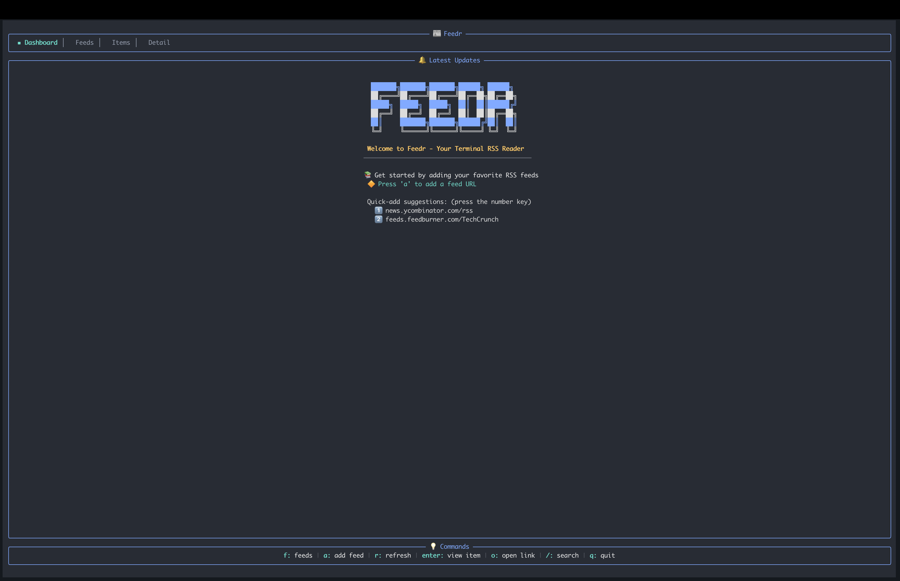

# Feedr - Terminal RSS Feed Reader 📰

Feedr is a feature-rich terminal-based RSS feed reader written in Rust. It provides a clean, intuitive TUI interface for managing and reading RSS feeds with elegant visuals and smooth keyboard navigation.



## ✨ Features

- **Dashboard View**: See the latest articles across all your feeds
- **Feed Management**: Subscribe to and organize multiple RSS feeds
- **Rich Content Display**: Beautiful formatting of articles with HTML-to-text conversion
- **Smart Search**: Quickly find content across all your feeds
- **Browser Integration**: Open articles in your default browser

## Installation

### Prerequisites

- Rust and Cargo (install from [https://rustup.rs/](https://rustup.rs/))

### Using Cargo Install (Recommended)
```bash
cargo install feedr
```

### Build from Source
```bash
git clone https://github.com/bahdotsh/feedr.git
cd feedr
cargo build --release
```

The binary will be available at `target/release/feedr`.

## 🎮 Usage

Run the application:

```bash
feedr
```

### Quick Start
1. When you open Feedr for the first time, press `a` to add a feed
2. Enter a valid RSS feed URL (e.g., `https://news.ycombinator.com/rss`)
3. Use arrow keys to navigate and `Enter` to view items
4. Press `o` to open the current article in your browser

### Keyboard Controls

#### General Navigation
| Key | Action |
|-----|--------|
| `Tab` | Cycle between views |
| `q` | Quit application |
| `r` | Refresh all feeds |
| `/` | Search mode |

#### Dashboard View
| Key | Action |
|-----|--------|
| `f` | Go to feeds list |
| `a` | Add a new feed |
| `↑/↓` | Navigate items |
| `Enter` | View selected item |
| `o` | Open link in browser |

#### Feed List View
| Key | Action |
|-----|--------|
| `h` / `Esc` | Go to dashboard |
| `a` | Add a new feed |
| `d` | Delete selected feed |
| `↑/↓` | Navigate feeds |
| `Enter` | View feed items |

#### Feed Items View
| Key | Action |
|-----|--------|
| `h` / `Esc` | Back to feeds list |
| `Home` | Go to dashboard |
| `↑/↓` | Navigate items |
| `Enter` | View item details |
| `o` | Open item in browser |

#### Item Detail View
| Key | Action |
|-----|--------|
| `h` / `Esc` | Back to feed items |
| `Home` | Go to dashboard |
| `o` | Open item in browser |

## Dependencies

- **[ratatui](https://github.com/ratatui-org/ratatui)**: Terminal UI framework
- **[crossterm](https://github.com/crossterm-rs/crossterm)**: Terminal manipulation
- **[reqwest](https://github.com/seanmonstar/reqwest)**: HTTP client
- **[rss](https://github.com/rust-syndication/rss)**: RSS parsing
- **[html2text](https://github.com/servo/html5ever)**: HTML to text conversion
- **[chrono](https://github.com/chronotope/chrono)**: Date and time handling
- **[serde](https://github.com/serde-rs/serde)**: Serialization/deserialization

## 📜 License

MIT

## Contributing

Contributions are welcome! Please feel free to submit a Pull Request.

1. Fork the repository
2. Create your feature branch (`git checkout -b feature/amazing-feature`)
3. Commit your changes (`git commit -m 'Add some amazing feature'`)
4. Push to the branch (`git push origin feature/amazing-feature`)
5. Open a Pull Request
